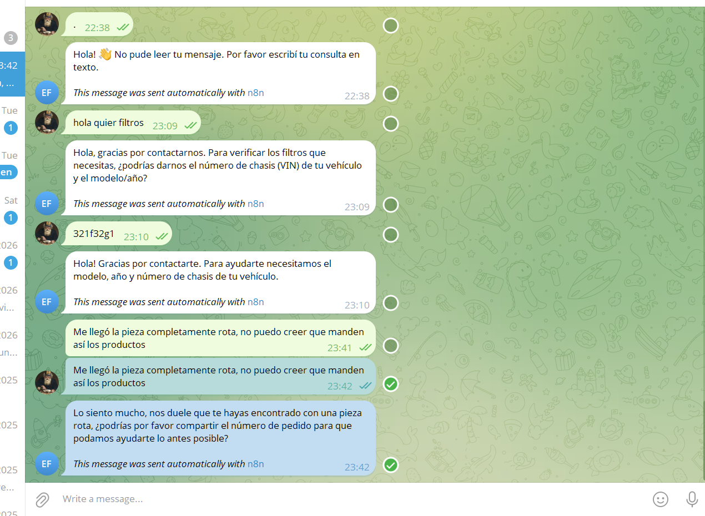
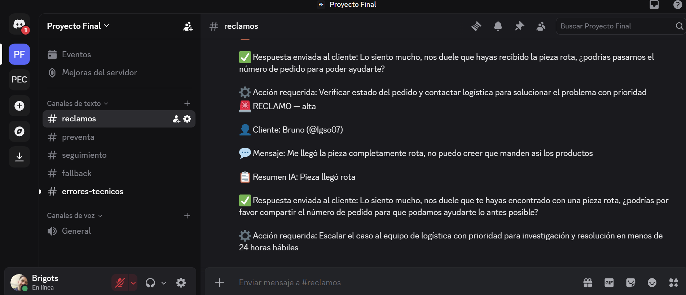

# Ford Repuestos — Sistema de Triage Inteligente de Mensajes
### Proyecto Final — Automatización con n8n y LLMs
**Coderhouse · IA Automation · Marzo 2026**

---

## Descripción del Proyecto

Sistema automático de clasificación y respuesta de mensajes de clientes para **Ford Repuestos**, una empresa que opera tres tiendas en Mercado Libre (Ford, Volkswagen y Omnicroft) y atiende clientes por WhatsApp.

El flujo recibe mensajes de clientes a través de un **bot de Telegram**, los clasifica con IA en tres categorías (reclamo, consulta preventa o seguimiento), genera una respuesta automática personalizada, registra todo en **Google Sheets** y notifica al equipo interno en **Discord**.

---

## Arquitectura del Sistema

```
Cliente escribe al bot de Telegram
        ↓
Telegram Trigger
        ↓
Preparar Datos del Mensaje (Code JS)
— Extrae: chat_id, nombre, username, mensaje
— Filtra: vacíos, emojis solos, puntuación, menos de 3 caracteres
        ↓
¿Mensaje válido? (IF)
    ↓ TRUE                    ↓ FALSE
LLM #1 Clasificador     Telegram → avisa al cliente
(Groq / Llama3-70b)
        ↓
Parsear Clasificación (Code JS)
        ↓
Switch — Tipo de Mensaje
    ├── RECLAMO
    │   └── LLM #2A → Parsear → Telegram Cliente → Sheets Logs → Discord #reclamos
    ├── CONSULTA_PREVENTA
    │   └── LLM #2B → Parsear → Telegram Cliente → Sheets Logs → Discord #preventa
    ├── SEGUIMIENTO
    │   └── LLM #2C → Parsear → Telegram Cliente → Sheets Logs → Discord #seguimiento
    └── FALLBACK
        └── Sheets Fallback → Telegram Cliente → Discord #fallback

── RAMA PARALELA ──────────────────────────────────────
Error Trigger → Parsear Error → Sheets Errores_Tecnicos → Discord #errores-tecnicos
```

---

## Vista del Flujo en n8n


---

## Estructura de Archivos

```
proyecto-final/
├── Trabajo_Final-bot_ford_repuestos.json  → Workflow completo para importar en n8n
├── prompts.txt                            → Prompts de todos los nodos LLM
├── README.md                              → Este archivo
└── documentacion_tecnica.docx             → Documentación técnica completa
```

---

## Requisitos Previos

- Cuenta en [n8n Cloud](https://n8n.cloud)
- Cuenta en [Groq](https://console.groq.com) con API key
- Bot de Telegram creado con [@BotFather](https://t.me/BotFather)
- Google Sheet con 3 hojas configuradas
- Servidor de Discord con 5 webhooks configurados

---

## Pasos para Importar y Configurar

### 1. Crear el Bot de Telegram

1. Abrí Telegram → buscá **@BotFather**
2. Mandá `/newbot`
3. Nombre del bot: `Ford Repuestos Bot`
4. Username: `fordrepuestos_bot` (debe terminar en "bot")
5. Copiá el **token** que te devuelve

### 2. Configurar Credenciales en n8n

En n8n → **Settings → Credentials → New**:

| Credencial | Tipo | Datos |
|---|---|---|
| Telegram Bot — Ford Repuestos | Telegram API | Token del bot |
| Groq API — Ford | Groq API | API Key de console.groq.com |
| Google Sheets — Ford | Google Sheets OAuth2 | Auth con cuenta Google |

### 3. Configurar Google Sheets

Crear un archivo con **3 pestañas**:

**Hoja `Logs`** — para reclamos, preventa y seguimiento:
```
fecha | canal | nombre_cliente | username_telegram | chat_id |
mensaje_original | categoria | urgencia | resumen_ia |
respuesta_enviada | accion_interna | estado | happy_path
```

**Hoja `Fallback`** — para mensajes no clasificados:
```
fecha | canal | nombre_cliente | username_telegram | chat_id |
mensaje_original | categoria | resumen_ia | respuesta_llm_cruda |
estado | happy_path
```

**Hoja `Errores_Tecnicos`** — para el Error Workflow:
```
fecha | workflow | execution_id | nodo_que_fallo |
tipo_error | mensaje_error | severidad | stack_trace | resuelto
```

### 4. Configurar Discord

Crear estos canales y generar un Webhook para cada uno:
- `#reclamos`
- `#preventa`
- `#seguimiento`
- `#fallback`
- `#errores-tecnicos`

Para crear el webhook: **Editar canal → Integraciones → Webhooks → Nuevo Webhook → Copiar URL**

### 5. Importar el Workflow

1. En n8n → **Workflows → Import from file**
2. Seleccionar `Trabajo_Final.json`
3. Asignar las credenciales en cada nodo que las requiera
4. En **Settings → Error Workflow** → seleccionar el mismo workflow (`Trabajo Final`)
5. Click en **Publish** para activar

---

## Casos de Prueba

| # | Mensaje | Resultado esperado |
|---|---|---|
| 1 | "Me llegó la pieza completamente rota" | Reclamo · urgencia alta · Discord #reclamos |
| 2 | "tienen filtro de aceite para un Ford Focus 2015?" | Preventa · Discord #preventa · pide chasis |
| 3 | "quería saber cuándo llega mi pedido" | Seguimiento · Discord #seguimiento |
| 4 | Mensaje forzado a fallback | Discord #fallback · Sheets Fallback · happy_path NO |
| 5 | Solo un punto "." | Mensaje inválido · bot avisa al cliente · flujo se detiene |
| 6 | Solo emojis | Mensaje inválido · bot avisa al cliente · flujo se detiene |

---

## Prueba 1 — Reclamo

| Telegram | Discord #reclamos |
|---|---|
|  |  |

**Google Sheets — Log:**


---

## Prueba 2 — Consulta Preventa

| Telegram | Discord #preventa |
|---|---|
|  |  |

**Google Sheets — Log:**


---

## Prueba 3 — Fallback

| Telegram | Discord #fallback |
|---|---|
|  |  |

**Google Sheets — Fallback:**


---

## Validaciones de Entrada

El nodo **Preparar Datos del Mensaje** filtra automáticamente:
- Mensajes vacíos
- Mensajes de menos de 3 caracteres reales (ej: `.`, `..`)
- Mensajes compuestos solo de emojis
- Mensajes compuestos solo de puntuación

---

## Stack Tecnológico

| Componente | Tecnología |
|---|---|
| Orquestación | n8n Cloud |
| LLM | Groq API — Llama-3.3-70b-versatile |
| Trigger y canal cliente | Telegram Bot API |
| Notificaciones equipo | Discord (5 webhooks) |
| Logs y auditoría | Google Sheets (3 hojas) |
| Código personalizado | JavaScript — Code nodes de n8n |

---

## Limitaciones Conocidas

- El LLM puede clasificar incorrectamente mensajes muy ambiguos
- Mensajes en idiomas distintos al español pueden reducir la precisión
- El bot no procesa imágenes, audios ni archivos adjuntos — solo texto
- Groq tiene límites de rate en el plan gratuito
